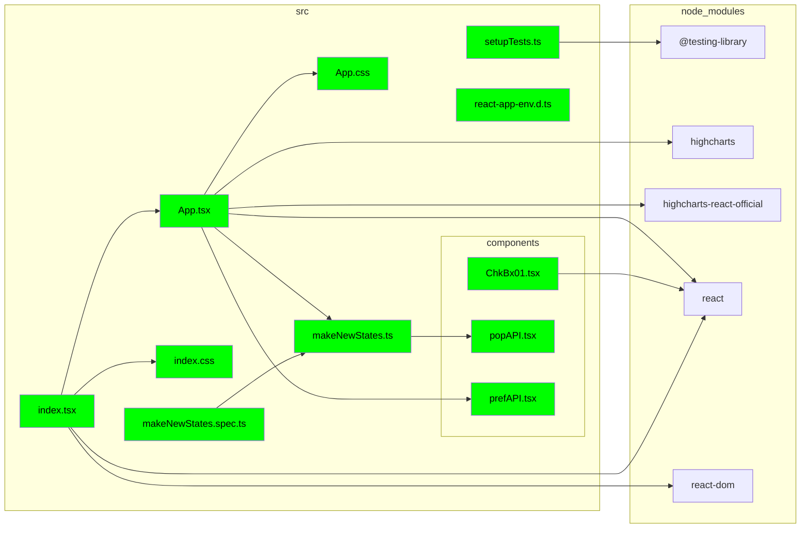
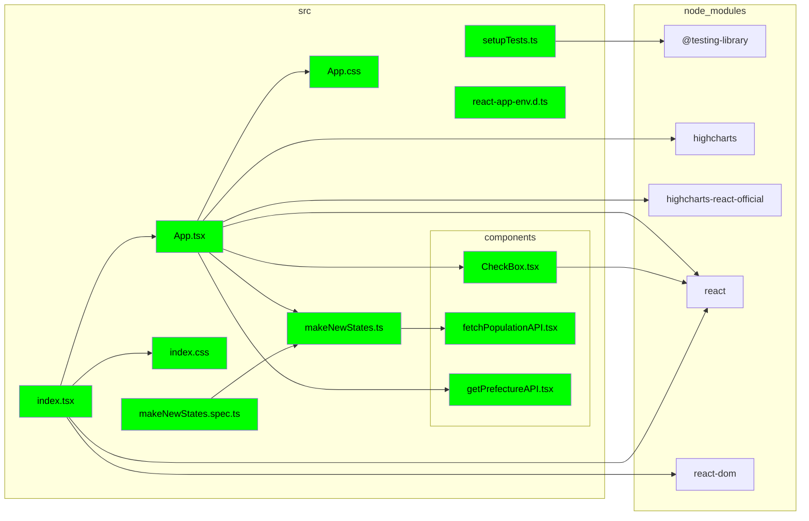
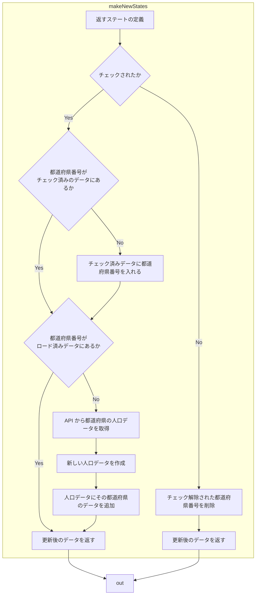
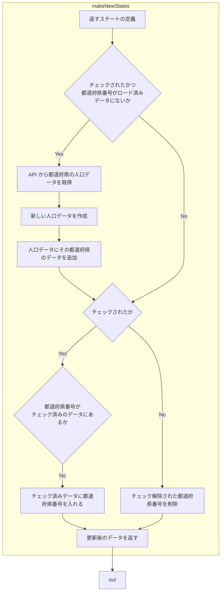
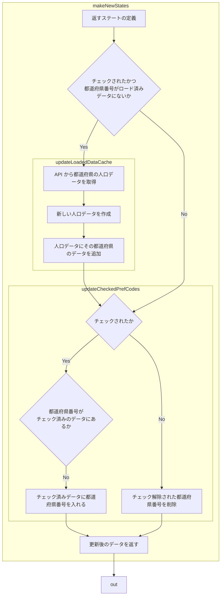

# t_sakoda による分析

## モジュール依存グラフ

### 変更前

```mermaid
flowchart LR

subgraph 0["node_modules"]
1["@testing-library"]
2["highcharts"]
3["highcharts-react-official"]
4["react"]
5["react-dom"]
end
subgraph 6["src"]
7["App.css"]
8["App.tsx"]
subgraph 9["components"]
a["ChkBx01.tsx"]
b["popAPI.tsx"]
c["prefAPI.tsx"]
end
d["index.css"]
e["index.tsx"]
f["makeNewStates.spec.ts"]
g["makeNewStates.ts"]
h["react-app-env.d.ts"]
i["setupTests.ts"]
end
8-->7
8-->c
8-->g
8-->2
8-->3
8-->4
a-->4
e-->8
e-->d
e-->4
e-->5
f-->g
g-->b
i-->1

style 7 fill:lime,color:black
style 8 fill:lime,color:black
style a fill:lime,color:black
style b fill:lime,color:black
style c fill:lime,color:black
style d fill:lime,color:black
style e fill:lime,color:black
style f fill:lime,color:black
style g fill:lime,color:black
style h fill:lime,color:black
style i fill:lime,color:black
```

### 変更後

<!-- DMDG BEGIN -->

```mermaid
flowchart LR

subgraph 0["node_modules"]
1["@testing-library"]
2["highcharts"]
3["highcharts-react-official"]
4["react"]
5["react-dom"]
end
subgraph 6["src"]
7["App.css"]
8["App.tsx"]
subgraph 9["components"]
a["CheckBox.tsx"]
b["fetchPopulationAPI.tsx"]
c["getPrefectureAPI.tsx"]
end
d["index.css"]
e["index.tsx"]
f["makeNewStates.spec.ts"]
g["makeNewStates.ts"]
h["react-app-env.d.ts"]
i["setupTests.ts"]
end
8-->7
8-->a
8-->c
8-->g
8-->2
8-->3
8-->4
a-->4
e-->8
e-->d
e-->4
e-->5
f-->g
g-->b
i-->1

style 7 fill:lime,color:black
style 8 fill:lime,color:black
style a fill:lime,color:black
style b fill:lime,color:black
style c fill:lime,color:black
style d fill:lime,color:black
style e fill:lime,color:black
style f fill:lime,color:black
style g fill:lime,color:black
style h fill:lime,color:black
style i fill:lime,color:black
```

<!-- DMDG END -->

## makeNewStates.ts

### 変更前

```mermaid
flowchart
subgraph makeNewStates
    0[返すステートの定義]-->1{チェックされたか}
    1 --> |No| 2[チェック解除された都道府県番号を削除]
    1 --> |Yes| 3{都道府県番号が\nチェック済みのデータにあるか}
    3 --> |Yes| 4{都道府県番号が\nロード済みデータにあるか}
    3 --> |No| 5[チェック済みデータに都道府県番号を入れる]
    2 --> 20[更新後のデータを返す]
    5 --> 4
    4 --> |Yes| 6[更新後のデータを返す]
    4 --> |No| 7[API から都道府県の人口データを取得]
    7 --> 8[新しい人口データを作成]
    8 --> 9[人口データにその都道府県のデータを追加]
    9 --> 6
end
10[out]
6 --> 10
20 --> 10
```

### 途中

```mermaid
flowchart
subgraph makeNewStates
    0[返すステートの定義]-->1{チェックされたかつ\n都道府県番号がロード済みデータにないか}
    1 --> |Yes| 3[API から都道府県の人口データを取得]
    3 --> 4[新しい人口データを作成]
    4 --> 5[人口データにその都道府県のデータを追加]
    5-->6{チェックされたか}
    1--> |No| 6
    6 --> |No| 7[チェック解除された都道府県番号を削除]
    6 --> |Yes| 8{都道府県番号が\nチェック済みのデータにあるか}
    8 --> |No| 9[チェック済みデータに都道府県番号を入れる]
    9 --> 10[更新後のデータを返す]
    7 --> 10
end
10 --> 11[out]
```

### 変更後

```mermaid
flowchart
subgraph makeNewStates
    0[返すステートの定義]-->1{チェックされたかつ\n都道府県番号がロード済みデータにないか}

    subgraph updateLoadedDataCache
        3[API から都道府県の人口データを取得]
        -->4[新しい人口データを作成]
        -->5[人口データにその都道府県のデータを追加]
    end
    1 --> |Yes| 3
    subgraph updateCheckedPrefCodes
        5-->6{チェックされたか}
        6 --> |No| 7[チェック解除された都道府県番号を削除]
        6 --> |Yes| 8{都道府県番号が\nチェック済みのデータにあるか}
        8 --> |No| 9[チェック済みデータに都道府県番号を入れる]
    end
    1--> |No| 6
    9 --> 10[更新後のデータを返す]
    7 --> 10
end
10 --> 11[out]
```
