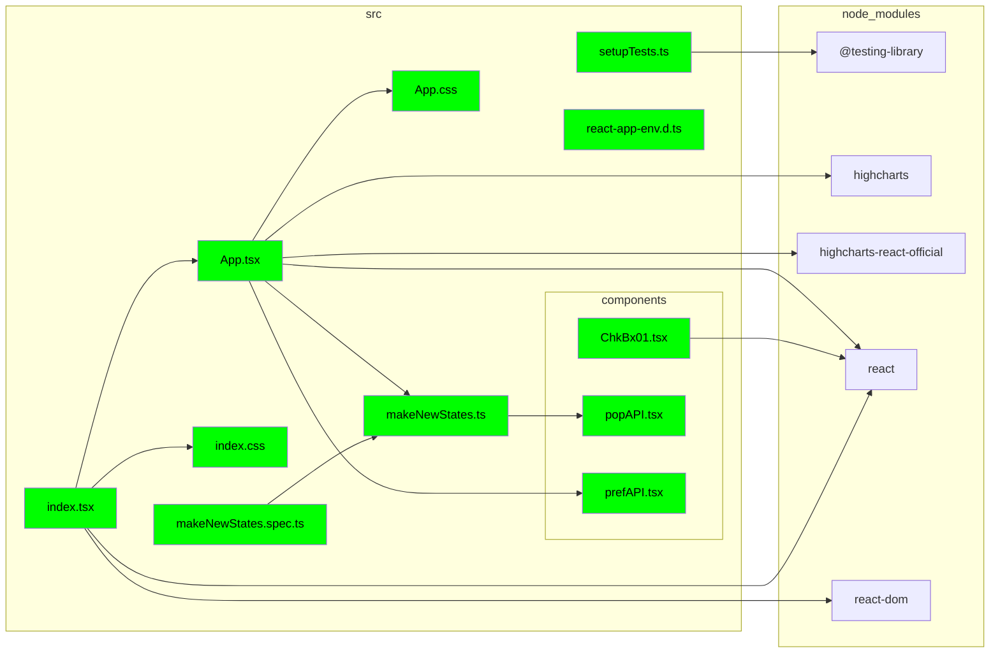

<!-- DMDG BEGIN -->

```mermaid
flowchart LR

subgraph 0["node_modules"]
1["@testing-library"]
2["highcharts"]
3["highcharts-react-official"]
4["react"]
5["react-dom"]
end
subgraph 6["src"]
7["App.css"]
8["App.tsx"]
subgraph 9["components"]
a["ChkBx01.tsx"]
b["popAPI.tsx"]
c["prefAPI.tsx"]
end
d["index.css"]
e["index.tsx"]
f["makeNewStates.spec.ts"]
g["makeNewStates.ts"]
h["react-app-env.d.ts"]
i["setupTests.ts"]
end
8-->7
8-->c
8-->g
8-->2
8-->3
8-->4
a-->4
e-->8
e-->d
e-->4
e-->5
f-->g
g-->b
i-->1

style 7 fill:lime,color:black
style 8 fill:lime,color:black
style a fill:lime,color:black
style b fill:lime,color:black
style c fill:lime,color:black
style d fill:lime,color:black
style e fill:lime,color:black
style f fill:lime,color:black
style g fill:lime,color:black
style h fill:lime,color:black
style i fill:lime,color:black
```

<!-- DMDG END -->
